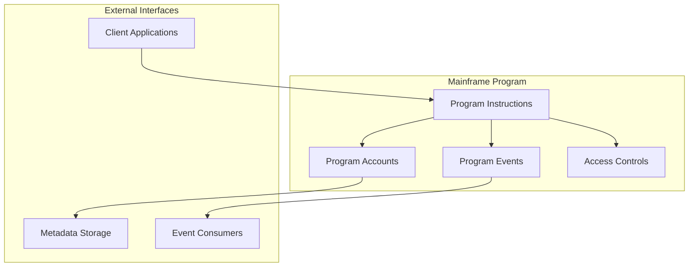
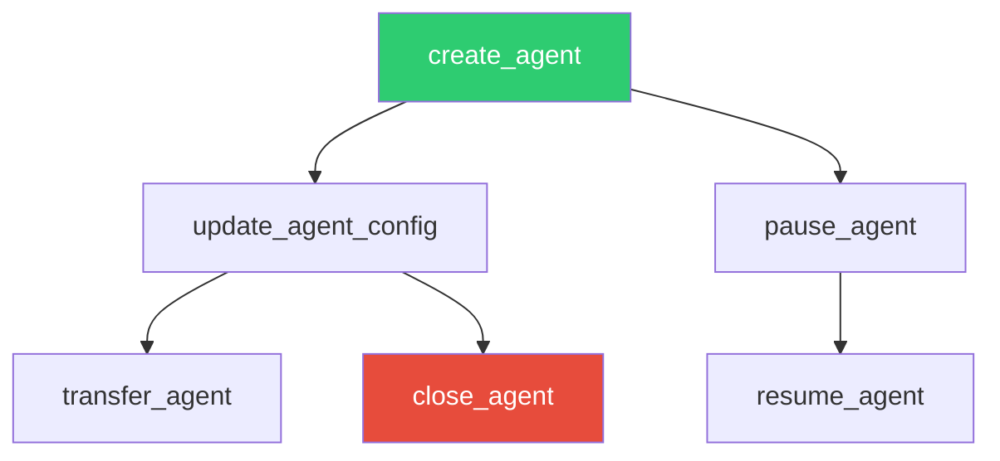
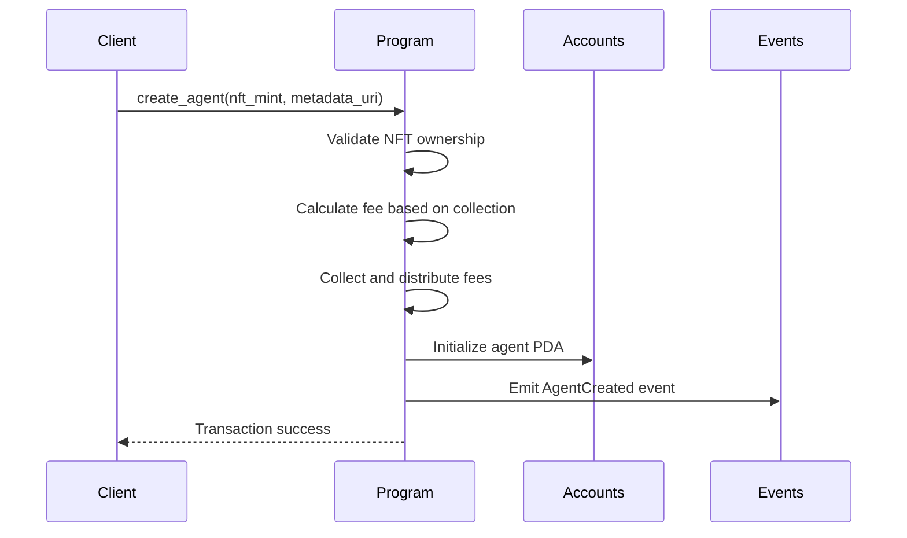

# Mainframe: Program Architecture

## Overview

Mainframe is a permissionless Solana Anchor program that manages AI agents linked to NFTs from verified collections. The program handles agent lifecycle management, fee distribution, and access controls while emitting events that external systems can consume for off-chain agent deployment.

## Program Structure

### Core Components



### Account Architecture

#### Agent Account Structure

```rust
#[account]
pub struct AgentAccount {
    pub nft_mint: Pubkey,              // Associated NFT (32 bytes)
    pub owner: Pubkey,                 // Current owner (32 bytes)
    pub collection_mint: Option<Pubkey>, // Collection for fee calculation (33 bytes)
    pub metadata_uri: String,          // Off-chain metadata URI (4 + 200 bytes)
    pub status: AgentStatus,           // Active/Paused/Closed (1 byte)
    pub activated_at: i64,             // Creation timestamp (8 bytes)
    pub updated_at: i64,               // Last modification (8 bytes)
    pub version: u64,                  // Configuration version (8 bytes)
    pub reserved: [u8; 32],            // Future upgrades (32 bytes)
}

#[derive(AnchorSerialize, AnchorDeserialize, Clone, PartialEq, Eq)]
pub enum AgentStatus {
    Active,    // Agent is operational
    Paused,    // Temporarily halted
    Closed,    // Permanently shut down
}
```

#### Protocol Configuration Account

```rust
#[account]
pub struct ProtocolConfig {
    pub authority: Pubkey,                   // Protocol admin (32 bytes)
    pub manager: Pubkey,                     // Manager for operations (32 bytes)
    pub genesis_collection_mint: Pubkey,     // Genesis collection (zero fees) (32 bytes)
    pub fees: FeeStructure,                  // Fee amounts (48 bytes)
    pub protocol_treasury: Pubkey,           // Protocol treasury wallet (32 bytes)
    pub validator_treasury: Pubkey,          // Validator treasury wallet (32 bytes)
    pub network_treasury: Pubkey,            // Network treasury wallet (32 bytes)
    pub protocol_treasury_bps: u16,          // Protocol share in basis points (2 bytes)
    pub validator_treasury_bps: u16,         // Validator share in basis points (2 bytes)
    pub network_treasury_bps: u16,           // Network share in basis points (2 bytes)
    pub paused: bool,                        // Emergency pause (1 byte)
    pub total_agents: u64,                   // Total agents created (8 bytes)
    pub total_partners: u64,                 // Total partner collections (8 bytes)
    pub max_partner_collections: u64,        // Max partners allowed (8 bytes)
    pub max_affiliate_bps: u16,              // Max affiliate commission bps (2 bytes)
    pub pending_authority: Option<Pubkey>,   // Pending authority for 2-step transfer (33 bytes)
    pub reserved: [u8; 20],                  // Future upgrades (20 bytes)
}

// Note: Partner collections are stored in separate PDAs (PartnerCollectionAccount)
// indexed by collection_mint, not in a Vec within ProtocolConfig

#[derive(AnchorSerialize, AnchorDeserialize, Clone)]
pub struct FeeStructure {
    pub create_agent: u64,          // 0.05 SOL in lamports
    pub update_agent_config: u64,   // 0.005 SOL in lamports
    pub transfer_agent: u64,        // 0.01 SOL in lamports
    pub pause_agent: u64,           // 0 SOL - Free
    pub close_agent: u64,           // 0 SOL - Free
    pub execute_action: u64,        // 0 SOL - Free
}
```

#### Partner Collection Account

Partner collections are stored in separate PDA accounts for scalability:

```rust
#[account]
pub struct PartnerCollectionAccount {
    pub collection_mint: Pubkey,     // Collection identifier (32 bytes)
    pub discount_percent: u8,        // 0-100 percentage discount (1 byte)
    pub name: String,                // Partner name (4 + 50 bytes)
    pub active: bool,                // Active status (1 byte)
    pub added_at: i64,               // Timestamp when added (8 bytes)
    pub bump: u8,                    // PDA bump seed (1 byte)
}
```

**PDA Derivation:**
```rust
seeds = [b"partner", collection_mint.as_ref()]
```

This architecture supports 1000+ partner collections without bloating the ProtocolConfig account.

### PDA Derivation Strategy

```rust
// Agent account PDA (unique per NFT)
pub fn derive_agent_pda(nft_mint: &Pubkey) -> (Pubkey, u8) {
    Pubkey::find_program_address(
        &[b"agent", nft_mint.as_ref()],
        &PROGRAM_ID
    )
}

// Protocol configuration PDA (singleton)
pub fn derive_protocol_config_pda() -> (Pubkey, u8) {
    Pubkey::find_program_address(
        &[b"protocol_config"],
        &PROGRAM_ID
    )
}
```

**Benefits:**

- **Collision-Resistant**: Based on NFT mint ensures uniqueness
- **Deterministic**: No need to store addresses off-chain
- **Efficient Lookups**: O(1) address generation
- **Program Ownership**: Guaranteed program authority over accounts

## Instruction Flow

### Agent Lifecycle Instructions



### Transaction Flow



### Core Instructions

#### Create Agent

```rust
pub fn create_agent(
    ctx: Context<CreateAgent>,
    nft_mint: Pubkey,
    metadata_uri: String,
) -> Result<()> {
    // 1. Validate NFT ownership and metadata
    // 2. Calculate fee based on collection tier
    // 3. Collect and distribute creation fee
    // 4. Initialize agent account with provided data
    // 5. Emit AgentCreated event for off-chain consumption
}
```

#### Update Configuration

```rust
pub fn update_agent_config(
    ctx: Context<UpdateAgentConfig>,
    new_metadata_uri: String,
) -> Result<()> {
    // 1. Verify caller is agent owner
    // 2. Collect update fee (if applicable)
    // 3. Update metadata URI and increment version
    // 4. Emit AgentUpdated event
}
```

#### Transfer Agent

```rust
pub fn transfer_agent(
    ctx: Context<TransferAgent>
) -> Result<()> {
    // One-sided operation: only new NFT owner signs and pays
    // 1. Validate new owner owns the NFT (via token account)
    // 2. Ensure agent not already owned by new owner
    // 3. New owner pays transfer fee
    // 4. Update agent ownership to new owner
    // 5. Emit AgentTransferred event
}
```

**Key Design**: Transfer is a one-sided operation where the new NFT owner claims control of the Agent without requiring the previous owner's signature. This enables seamless ownership transfer when NFTs are traded or transferred.

## Fee Distribution System

### Fee Calculation Logic

```rust
impl ProtocolConfig {
    pub fn calculate_base_fee(&self, operation: &str) -> u64 {
        match operation {
            "create_agent" => self.fees.create_agent,
            "update_agent_config" => self.fees.update_agent_config,
            "transfer_agent" => self.fees.transfer_agent,
            "pause_agent" => self.fees.pause_agent,
            "close_agent" => self.fees.close_agent,
            "execute_action" => self.fees.execute_action,
            _ => 0,
        }
    }

    pub fn apply_discount(base_fee: u64, discount_percent: u8) -> u64 {
        if discount_percent >= 100 {
            return 0;
        }
        let discount_multiplier = 100 - discount_percent as u64;
        base_fee * discount_multiplier / 100
    }
}

// Note: Fee calculation with collection discounts is done in processors:
// 1. Check if collection matches genesis_collection_mint (0% fee)
// 2. Look up PartnerCollectionAccount PDA by collection_mint for discount
// 3. Apply discount to base fee
```

### Automatic Distribution

```rust
impl ProtocolConfig {
    pub fn distribute_fee<'info>(
        &self,
        fee_amount: u64,
        payer: &AccountInfo<'info>,
        protocol_treasury: &AccountInfo<'info>,
        validator_treasury: &AccountInfo<'info>,
        network_treasury: &AccountInfo<'info>,
        system_program: &AccountInfo<'info>,
    ) -> Result<()> {
        if fee_amount == 0 {
            return Ok(());
        }
        
        // Validate basis points sum to 10,000 (100%)
        let total_bps = self.protocol_treasury_bps
            .checked_add(self.validator_treasury_bps)
            .and_then(|x| x.checked_add(self.network_treasury_bps))
            .ok_or(MainframeError::InvalidTreasuryDistribution)?;
        require!(total_bps == 10_000, MainframeError::InvalidTreasuryDistribution);

        // Calculate distribution using basis points (1 bps = 0.01%)
        let protocol_fee = fee_amount * self.protocol_treasury_bps as u64 / 10_000;
        let validator_fee = fee_amount * self.validator_treasury_bps as u64 / 10_000;
        let network_fee = fee_amount * self.network_treasury_bps as u64 / 10_000;

        // Handle remainder from rounding (goes to protocol treasury)
        let remainder = fee_amount - (protocol_fee + validator_fee + network_fee);
        let protocol_fee_final = protocol_fee + remainder;

        // Transfer to respective treasury accounts using CPI
        transfer_lamports(payer, protocol_treasury, protocol_fee_final, system_program)?;
        transfer_lamports(payer, validator_treasury, validator_fee, system_program)?;
        transfer_lamports(payer, network_treasury, network_fee, system_program)?;
        
        Ok(())
    }
}
```

## Event System

### Program Events

```rust
#[event]
pub struct AgentCreated {
    pub agent_account: Pubkey,
    pub nft_mint: Pubkey,
    pub owner: Pubkey,
    pub collection_mint: Option<Pubkey>,
    pub metadata_uri: String,
    pub timestamp: i64,
    pub version: u64,
}

#[event]
pub struct AgentUpdated {
    pub agent_account: Pubkey,
    pub owner: Pubkey,
    pub metadata_uri: String,
    pub old_version: u64,
    pub new_version: u64,
    pub timestamp: i64,
}

#[event]
pub struct AgentTransferred {
    pub agent_account: Pubkey,
    pub nft_mint: Pubkey,
    pub old_owner: Pubkey,
    pub new_owner: Pubkey,
    pub timestamp: i64,
}
```

### Event Consumption Pattern

External systems can monitor program events to:

- Deploy agents when `AgentCreated` is emitted
- Update agent configurations when `AgentUpdated` is emitted
- Handle ownership changes when `AgentTransferred` is emitted
- Track agent lifecycle for analytics and reporting

## Security Model

### Access Control Matrix

| Operation       | NFT Owner           | Protocol |
| --------------- | ------------------- | -------- |
| Create Agent    | ✅ (must own NFT)   | ❌       |
| Update Config   | ✅ (must own agent) | ❌       |
| Transfer Agent  | ✅ (new owner only) | ❌       |
| Pause/Resume    | ✅ (must own agent) | ❌       |
| Close Agent     | ✅ (must own agent) | ❌       |
| Update Fees     | ❌                  | ✅       |
| Emergency Pause | ❌                  | ✅       |
| Add Partners    | ❌                  | ✅       |

### Validation Checks

```rust
// NFT ownership validation
require!(
    nft_token_account.owner == signer.key() &&
    nft_token_account.amount == 1,
    MainframeError::NFTNotOwned
);

// Agent ownership validation
require!(
    agent_account.owner == signer.key(),
    MainframeError::Unauthorized
);

// Protocol not paused
require!(
    !protocol_config.paused,
    MainframeError::ProtocolPaused
);
```

## Performance Characteristics

### Transaction Metrics

| Operation      | Compute Units | Account Size  | Constraints       |
| -------------- | ------------- | ------------- | ----------------- |
| Create Agent   | ~15,000 CU    | 398 bytes     | Must own NFT      |
| Update Config  | ~8,000 CU     | No change     | Must own agent    |
| Transfer Agent | ~12,000 CU    | No change     | Both parties sign |
| Pause/Resume   | ~5,000 CU     | No change     | Owner only        |
| Close Agent    | ~6,000 CU     | Status change | Irreversible      |

### Scaling Considerations

**Account Design:**

- Fixed-size agent accounts (398 bytes) for predictable rent costs
- Efficient PDA derivation with minimal compute overhead
- Reserved space for future upgrades without account migrations

**Compute Optimization:**

- Early validation failures to save compute units
- Efficient fee calculations using integer arithmetic
- Minimal stack usage (well under 4KB limit)

## Error Handling

```rust
#[error_code]
pub enum MainframeError {
    #[msg("NFT not owned by the signer")]
    NFTNotOwned = 6000,
    #[msg("Agent is not active")]
    AgentNotActive,
    #[msg("Protocol is paused")]
    ProtocolPaused,
    #[msg("Unauthorized operation")]
    Unauthorized,
    #[msg("Invalid metadata URI")]
    InvalidMetadataUri,
    #[msg("Treasury percentages must sum to 100")]
    InvalidTreasuryDistribution,
    #[msg("Version counter overflow")]
    VersionOverflow,
}
```

## External Integration Points

### Client Applications

- Build transactions using SDK or direct program calls
- Monitor account changes for real-time agent status
- Handle transaction confirmation and error states
- Parse program events for application logic

### Agent Runtime Systems

- Subscribe to `AgentCreated` and `AgentUpdated` events
- Fetch metadata from URIs provided in events
- Deploy and manage agent instances based on program state
- Sync agent status with on-chain state

### Analytics & Monitoring

- Track protocol metrics from program events and accounts
- Monitor fee collection and treasury distribution
- Generate usage reports and performance analytics
- Implement alerting for protocol health monitoring
